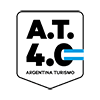
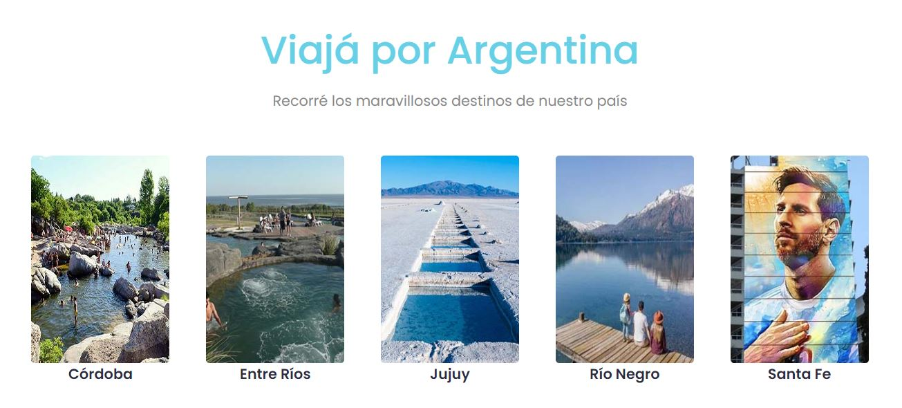

 

**Argentina Turismo 4.0** es el resultado del Trabajo Práctico Integrador presentado en el nivel inicial de **Argentina Programa 4.0**

La idea de desarrollar una página de turismo que proponga recorrer Argentina, es el resultante de haber descubierto que ese era nuestro punto en común, además de ofrecer la posibilidad de que todos pudieran crear "su" página dentro de una web, en lugar de sólo una sección.

Para el desarrollo de está página utilizamos: **HTML,CSS y JavaScript** incorporando también herramientas del framework **Bootstrap** y un .json local.

Link a la página: https://lorena-distefano.github.io/Argentina-Turismo-4.0/    🚀 

Agradecemos a **Argentina Programa 4.0** la oportunidad de sumar herramientas y conocimientos que nos abrirán puertas en el mundo IT.

✒️ El equipo: **Cristina Alegre, Lorena Di Stefano, Silvina Gaitan, Marcos Gaso, Sebastián Pittaluga**
Abril 2023
